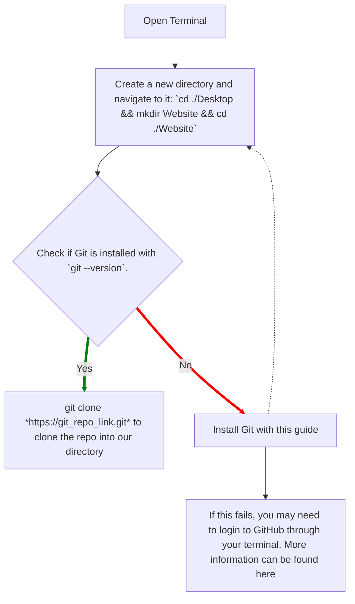

**Copyright (C) Cecil Smith - All Rights Reserved**

Unauthorized copying of any file (other than the instructional content on this page), via any medium is strictly prohibited

Proprietary and confidential

Written by Cecil Smith, July 2022

# Next.js with React and MUI

# Installation instructions

1. Open Terminal
2. Create a new directory and navigate to it
   1. Ex: `cd ./Desktop && mkdir Website && cd ./Website`
3. Check if git is installed with `git --version`. If installed, skip to step 4.
   1. If not installed, follow this page's instructions: [install git](https://git-scm.com/book/en/v2/Getting-Started-Installing-Git)
   2. Check if git is installed again with `git --version`
4. Run `git clone *https://git_repo_link.git*` to clone the repo into our directory
   1. If this fails, you may need to login to GitHub through your terminal. More information can be found [here](https://docs.github.com/en/authentication/keeping-your-account-and-data-secure/creating-a-personal-access-token). 
      * Get a `Personal Access Key` from your account settings under `Developer Options`.
      * Create a PAT and take note of it.
      * Use your username for the `username` and your *token* for the `password`.
      * If successful, move onto step 5.
   2. If that is not the problem, you may need a fresh git link to the repo. You can get it on the repo's site by clicking on the green download button and copying the link there. It will end with "`.git`"
   3. Once you have diagnosed the problem, retry `git clone *git link*`
5. Now that the repo is downloaded, we need to make sure Node.js is installed. Check whether it is installed with `node -v`
   1. If it is installed, got to step 6.
   2. If it is not installed, install it following the documentation [here](https://nodejs.dev/learn/how-to-install-nodejs).
6. Check that Node Package Manager is installed with `npm -v`. It should be already installed with Node.js.
7. **In the directory of your project (you may need to re-navigate there as it may be in a subfolder)**, run `npm install`. This will install all the necessary packages to get your project running.
8. Run `npm run build`
9. Run `npm start`
10. The website should be running on port 3000.

